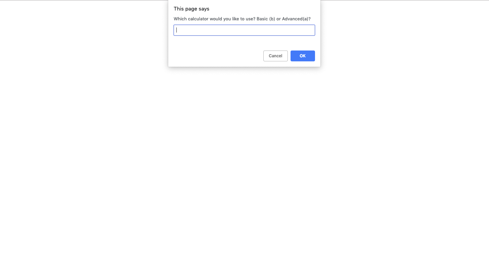
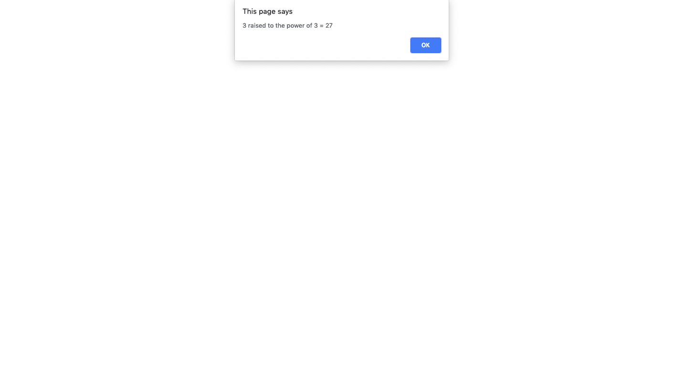

# Sparta JavaScript Calculator

## Task

Write a command line Calculator with two settings: __basic__, and __advanced__.

## Result

Uses text input boxes with conditionals to: determine what calculator the user needs; carry out the calculation they needed and display the result.

## Instructions

Clone the git repository. Open index.html locally in your browser.
